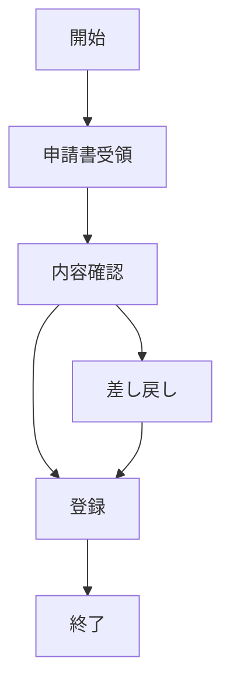
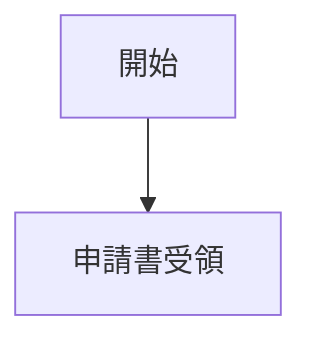
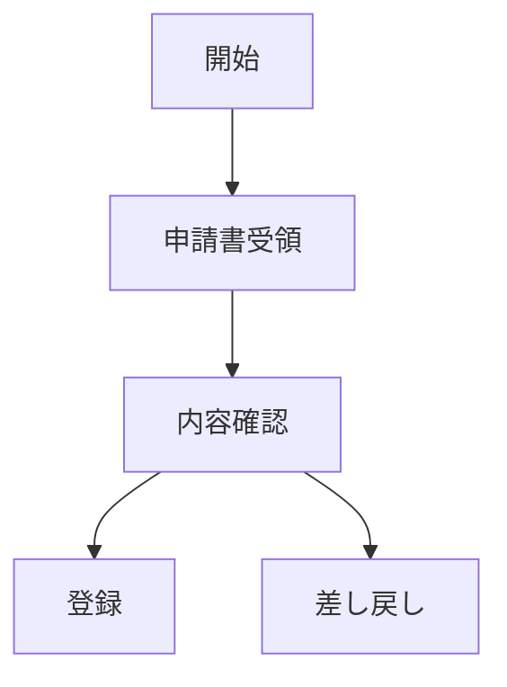
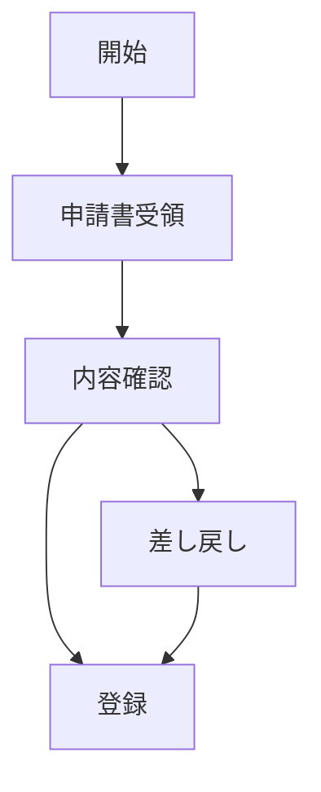

# mermaidで記載できるダイアグラムのチュートリアル


* 上記の図を作成するには以下の手順を踏みます(シーケンス図)

>>

    ```mermaid

    ```
  ①  初めに上記のコードを記入し


>>
    ```mermaid
    graph TD;

    ```
②graph TD; この記述がなければグラフを表示できません

>>
    ```mermaid
    graph TD;
        開始-->申請書受領;
    ```
③手始めにこのように入力すると
下記のような表示になります
   


④分岐をさせたい場合にはこのようになります
>>
    ```mermaid
    graph TD;
    開始-->申請書受領
    申請書受領-->内容確認
    内容確認-->登録;
    内容確認-->差し戻し;
    ```  


>>
    ```mermaid
    graph TD;
    開始-->申請書受領
    申請書受領-->内容確認
    内容確認-->登録;
    内容確認-->差し戻し;
    差し戻し-->登録
    ```

⑤最後に”登録”を入力し完成です



 * この段階をこなす事で作成することが出来ます