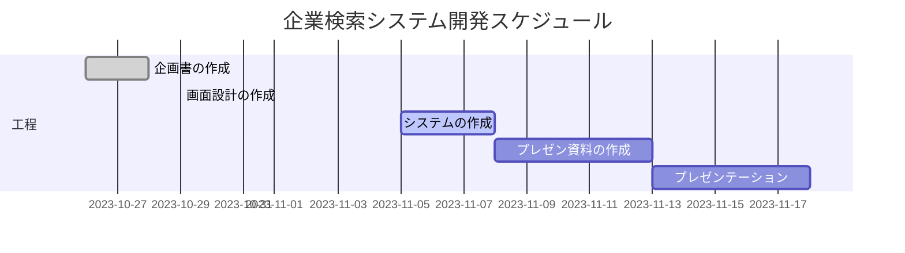

## 4-1[開発スケジュール]

## 4-2担当表  

* プロジェクトリーダー
>>
    開発プロジェクトを総合的に総括する
    主なミッションは企画からプレゼンまでのロードマップの作製やタスク管理

* 開発リーダー
>>
    目標成果物の責任を有する
    主なミッションは開発方針の策定、開発スケジューリング、開発フェーズのタスク管理

* 企画書担当
>>
    開発の達成に責任を有する
    主なミッションは研究企画書の考案・作成・プロジェクトの軌道修正、プレゼン

* サブリーダー
>>
    開発の達成に責任を有する
    主なミッションは開発リーダーの補助